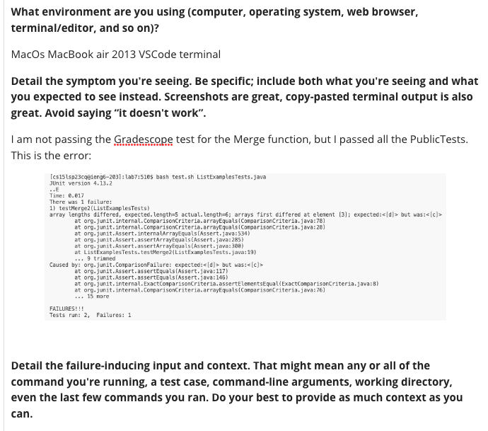
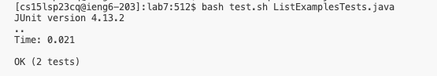

# Debugging!
## the original post

## the TA response

## the resolution

## the setup
The file and directory structure needed to replicate this scenario can only be replicated by  
Cloning the lab7 repository from CSE15l lab from the command-line in a terminal  
Then you will want to change directory into `lab7`  
Next, you will need to do `bash test.sh ListExamplesTests.java` from the command-line  
to compile and run the file so you can see what tests you passed or failed  
You should get a pass with 2/2 but to replicate the student's mistake you need to change the expected  
array to the way it is shown in the screenshot  
Adding a `c` element to correctly reflect the missing element once merged should fix the problem  
Run `bash test.sh ListExamplesTests.java` again and you should pass all tests again.
