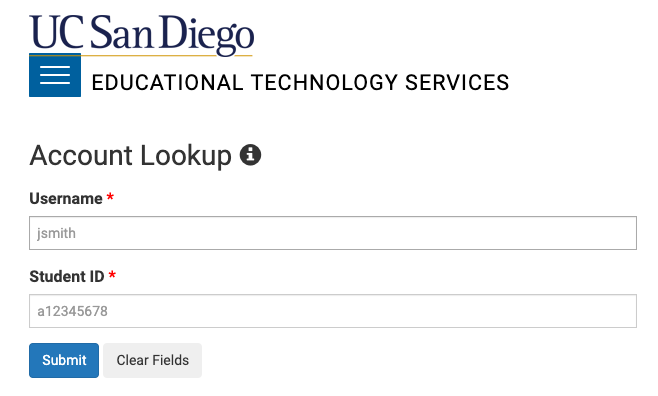
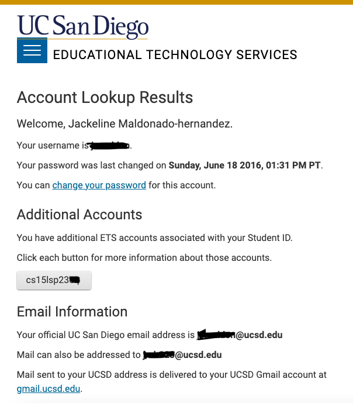
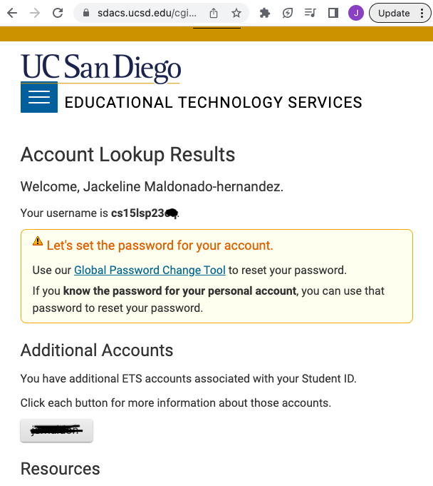
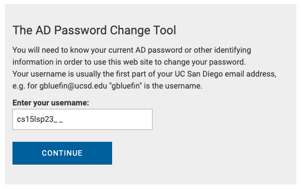
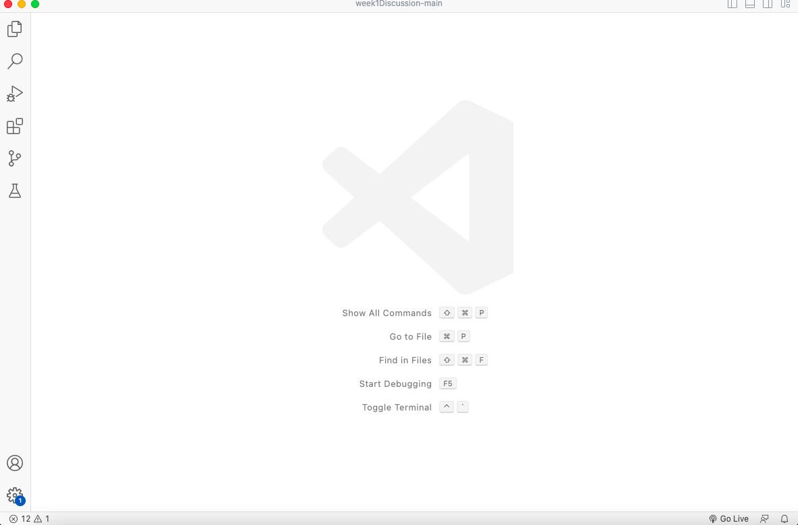
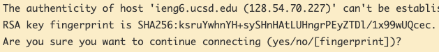
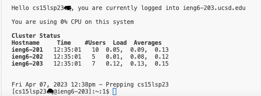
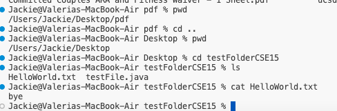

# Connecting to a Remote Server #
 
*5 minute read, 30-90 minute setup* 

In this tutorial, we are going to learn how to (legally) hack into a remote server from our computer and gain access to its files!
We will be using VSCODE and course-specific account access to connect to UCSD computers.

### Part 1 : Finding Course-Specific Credentials ###
Before doing anything we need to know the username and password associated with the account we want to access.

Start by visiting the link below: 
https://sdacs.ucsd.edu/~icc/index.php

Login with your student ID 
and student username.
Note: this should be the first part of your student email before the “@“ (i.e student1 is the username for student1@ucsd.edu)

Once logged in you should see a page titled **Account Lookup Results** navigate to the **Additional Accounts** section.
Depending on your course history there may be several buttons to choose from.
**Click** the account button relevant to this course, it should start with cs15lsp23__
The blank should be replaced by the last two letters assigned to your username.

You should now be on a page that looks very similar to the previous page. Except now, your course-specific username should be the first thing under **Account Lookup Results**. You should also see a warning box prompting you to set your account password. Click the blue <ins>Global Password Change Tool</ins> link.

#
When redirected, make sure to enter your course-specific username, NOT your general username! 
Note: Resetting passwords requires a minimum of 15-60 min before a successful login.

*If VSCODE is already downloaded onto your computer, wait at least 15 min before moving onto Part 3.*. 

*If you do not have VSCODE downloaded continue to Part 2.*
#

### Part 2: Downloading VSCODE ###
Visual Studio Code is a code editor and you will use its terminal to connect to a remote computer. An internet connection is necessary. 

Go to the link https://code.visualstudio.com/

Download the version that corresponds to your operating system and open the editor.

Tip: On Mac, make sure to move VSCODE out of your Downloads folder and into your Apps Folder if you can’t find it in Spotlight.

VSCODE should look something like this:

### Part 3: Remotely Connecting ###
*Reminder: Make sure you waited at least 15 minutes to let the password set before starting this section.*

The hardest part is already past us.

Next fill in the last two letters in the following command and copy it into VSCODE terminal.
Enter ssh cs15lsp23__@ieng6.ucsd.edu
Note: It is highly recommended that you use copy and paste, especially when typing in the password since it will be hidden.

If you run into a question about authenticity and connecting? Choose “yes”, this is normal since it should be your first time connecting to the server.

If all the information was correct you should now be virtually connected to another computer!

If you waited the appropriate amount of time and you are still having trouble logging in, go back to the <ins>Global Password Change Tool</ins>. Reset your course specific account password, and redo this section.

### Part 4: Trying Some Commands ###
The first command you should try in your terminal, should always be pwd since it will let you know what directory you are in.
Other notable commands include ls, cd, and  ~
Review the following screenshots to see what these and other commands can do:

