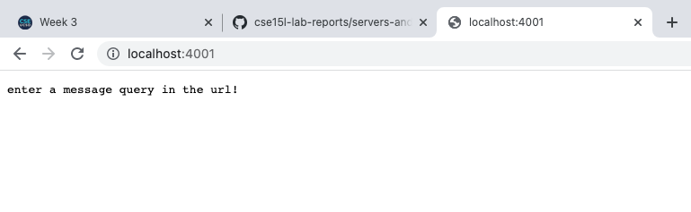
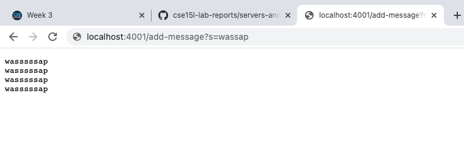
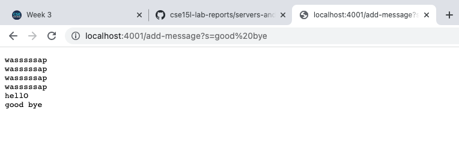
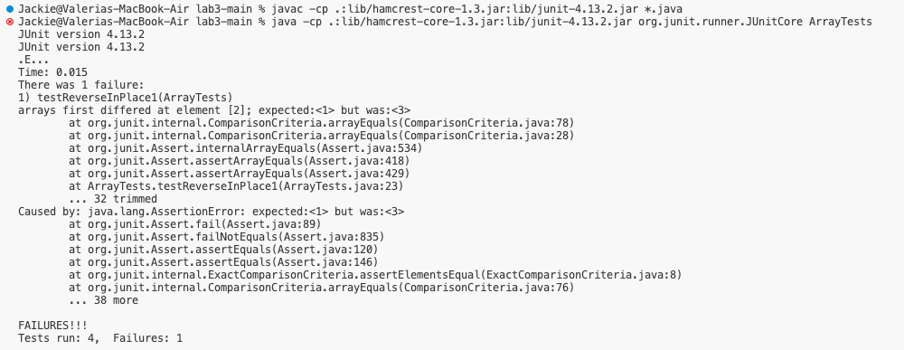

## Servers and Bugs 
### Part 1 ###
### Building a Web Server
Building off of the files we used in Lab, I created a file called `StringServer.java` with the following code: <br>

                    class Handler implements URLHandler {
                        String text = ""; 

                            public String handleRequest(URI url) {
                                if (url.getPath().equals("/")) {
                                    return String.format("enter a message query in the url!");
                                }
                                if (url.getPath().contains("/add-message")) {
                                    String[] parameters = url.getQuery().split("=");
                                    if (parameters[0].equals("s")) {    
                                        text += parameters[1] + "\n"; 
                                        String.format(text);         
                                    }
                                    return text;
                                }
                                return "404 Not Found!";
                            }   
                        }
                        
                        
My code server ran successfully with the messages shown below: <br>


The image above is the output of running `java StringServer 4001` in the terminal. <br>
In the **`handleRequest`** method, the first if condition is satisified upon the start up of the server.<br>
Since, there is no input for the message query (after the "="), I added code to print out a default message. <br>
Although, not shown in the image above, the code for starting up a server is found in the same file as the **`handleRequest`** method and looks like:<br>

    public class StringServer {
      public static void main(String[] args) throws IOException {
          if(args.length == 0){
              System.out.println("Missing port number! Try any number between 1024 to 49151");
              return;
            }

          int port = Integer.parseInt(args[0]);

          Server.start(port, new Handler());
            }
          }


The port number I chose **`4001`** and the method in the **`class Handler`** is called in the last line of the main method above.


The image above is the output of passing the String value `wassup` in the message query.<br>
Tracing the **`handleRequest`** method, this means that the first if condition is not satisfied because we actually extend the URL with a query value, so the next lines of code are ran. <br>
An array `paramaters` is made of the values found after the `s?=` signaling a String query. <br>
A String variable `text` is updated by String query value `wassup` concatenated with `\n` a new line. 



The image above is the output of passing the String value `hellO` and then `good bye` for the message query in the URL.<br>
Tracing the **`handleRequest`** method, we follow that the String variable `text` is updated by `hellO` and then `good bye` and each time is concatenated with `\n` a new line. So the outputs are printed separately every time the server resolves the query.
        
### Part 2 ###
#### Testing Methods in `ArrayExamples.java`

Failure-inducing Input for `reverseInPlace`: <br>

    @Test
      public void testReverseInPlace1() { 
        int[] input2 = {1,2,3}; 
        ArrayExamples.reverseInPlace(input2); 
        assertArrayEquals(new int[]{3,2,1}, input2); 
      }

Non-failiure-inducing Input for `reverseInPlace`: <br>

        @Test
          public void testReverseInPlace2() {
            int[] input3 = {1,1};
            ArrayExamples.reverseInPlace(input3);
            assertArrayEquals(new int[]{1,1}, input3);
          }

Symptoms as Seen in the Terminal: <br>



Fix the Bug: <br>

<table>
<tr>
<th>Before</th>
<th>After</th>
</tr>
<tr>
<td>
  
``` 
        static void reverseInPlace(int[] arr) {
            for(int i = 0; i < arr.length; i += 1) {
              arr[i] = arr[arr.length - i - 1];
            }
          }
```
  
</td>
<td>

```
    
        static void reverseInPlace(int[] arr) {
            int temp = 0;
            for(int i = 0; i < arr.length/2; i += 1) {
              temp = arr[i];
              arr[i] = arr[arr.length - i - 1];
              arr[arr.length - i - 1] = temp;

            }
          }
```

</td>
</tr>
</table>

The problem with the original code was that while it started off correctly reversing elements in the array, after the halfway point it displayed a non-reversed order. This behavior resulted from how the array was completely iterated through so the assignments from the start get assigned to the end too. For instance, an array `{1,2,3,4,5}` becomes `{5,4,3,4,5}`, so the for loop must be adjusted to iterate only to the halfway point. The second adjustment is implementing a temporary field to keep track of the elements that are being indexed, so that there is no mixup with the assignments.
        
### Part 3 ###
In Week 2, deciphering the parts of a URL was an insightful discovery that made building a server less daunting. I had tested HTML, CSS, and JavaScript code on a temporary server before for another class -- COGS 3. However, the way I launched a temporary server was through VSCODE's `Go Live` option, so I never really knew how this happened without the editor. I also bought a domain about a year ago, but never made anything on it. So it's more of a parked domain. Now, I feel hopeful about actually being able to develop some content because I'm more knowledgeable about how webpages are working. I'm especially interested in how I can generate simple interactive changes that a user can see just from the updates we made to our server in Lab 2.
